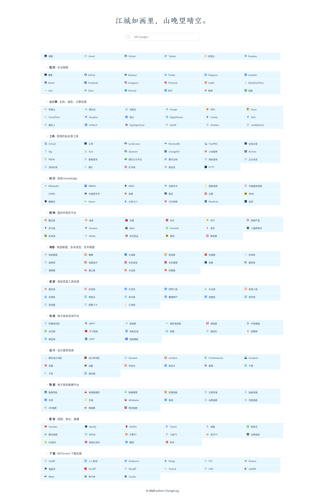

# 个人导航网站
### Fork from
[https://github.com/TopVitamin/static-nav](https://github.com/TopVitamin/static-nav)

### 优化与负优化
- 手机自适应
- Google CN API 自动获取 favicon.ico
- 腾讯公益 404
- 今日诗词 API
- jsDelivr CDN
- smoothScroll
- toTop
- Google fonts

### Live Demo
- [https://s.eallion.com](https://s.eallion.com)
- [https://favorite.wiki](https://favorite.wiki)

### 老版本 mdWiki
- [https://favorite.wiki/old](https://favorite.wiki/old)

### LICENSE
```
GLWT（祝你好运）公共许可证
版权所有（C）每个人，除了作者

任何人都被允许复制、分发、修改、合并、销售、出版、再授权或
任何其它操作，但风险自负。

作者对这个项目中的代码一无所知。
代码处于可用或不可用状态，没有第三种情况。


                祝你好运公共许可证
            复制、分发和修改的条款和条件

0 ：在不导致作者被指责或承担责任的情况下，你可以做任何你想
要做的事情。

无论是在合同行为、侵权行为或其它因使用本软件产生的情形，作
者不对任何索赔、损害承担责任。

祝你好运及一帆风顺。
```

### Screenshot
